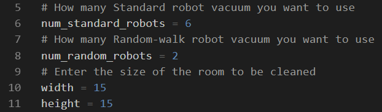

# Content
1. [Prerequisites](#Prerequisites)
2. [Simulation introduction](#simulation-introduction)
3. [How to run robot vacuum simulation](#how-to-run-robot-vacuum-simulation)

# Prerequisites
Python 2.7 with package:
* matplotlib, to install use this command: `py pip -m install matplotlib`
* [Python 2.7 download link](https://www.python.org/downloads/release/python-2718/)

# Simulation introduction
iRobot is a company that sells [vacuuming robots](https://www.irobot.com/). The vacuuming robot moves around the floor, cleaning the area it passes over.

In simulation of robot vacuum project, a simulation model is build and visualize to see robot vacuum in action.

## Simulation details
**The room**: The room is rectangular with given width `w` and height `h`. Initially the entire floor is dirty.

**Tiles**: The room with size (w * h) will have (w * h) tiles need to be cleaned. Each tile is identify by it coordination: (0, 0), (0, 1), ..., (w-1, h-1).

**Robot motion rules**:
* The robot is placed randomly inside the room.
* The robot has a direction of motion.
* All robots move at a constant speed throughout the simulation.
* If the robot detects that it will hit the wall, it will change a new direction randomly.

Sample graph with explanation:

  

**Terminate the simulation**: The simulation ends when robots clean all tiles in a room.

## Two types of robot vacuum
**Standard Robot** vacuum:
- A standard robot vacuum moves and cleans the floor in a straight line.
- If it hits the wall, it will change direction randomly

**Random-walk Robot** vacuum:
- A random-walk robot vacuum changes direction after each moving step. So the random-walk robot is kind of a *crazy* robot with *drunk* movement.

## Programming concepts
This robot vacuum simulation program uses Python 2.7 and object-oriented concepts to build all necessary classes such as: Robot, Room, Tile and Position.

# How to run robot vacuum simulation
**File structures**:
```
├── images -- contain images in README.md
classes.py -- Classes are implemented here
main.py -- Python file to run the simulation
test_movement.py -- Run to see each robot movement
visualize.py -- Code to animate the simulation
README.md -- Information about robot vacuum simulation project
```

If a file with extension `.pyc` appears, you can leave it there or delete it. `.pyc` files is used to make the animation run smoothly.

**See the movement of each robot vacuum type**
- Open and run `test_movement.py` to see the movement of each robot.
- The 1st graph shows a Standard Robot vacuums a 3x3 room. The robot stops moving when all tiles are cleaned. Close the animation window.
- The 2nd graph shows a Random-walk Robot vacuums a 3x3 room. The robot stops moving when all tiles are cleaned. Close the animation window.

**Run and start the simulation**:
- Open `main.py`
- You can change the simulation options:
  
- Run `main.py` and see robot vacuums in action!